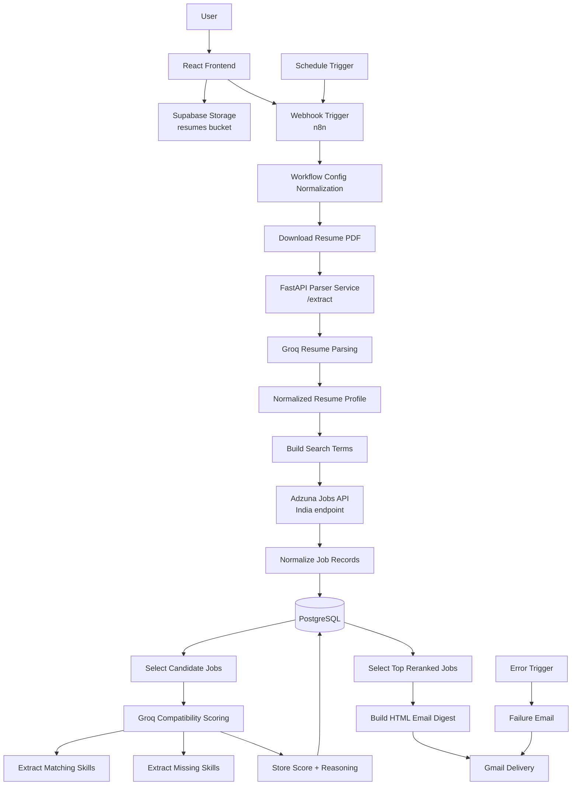
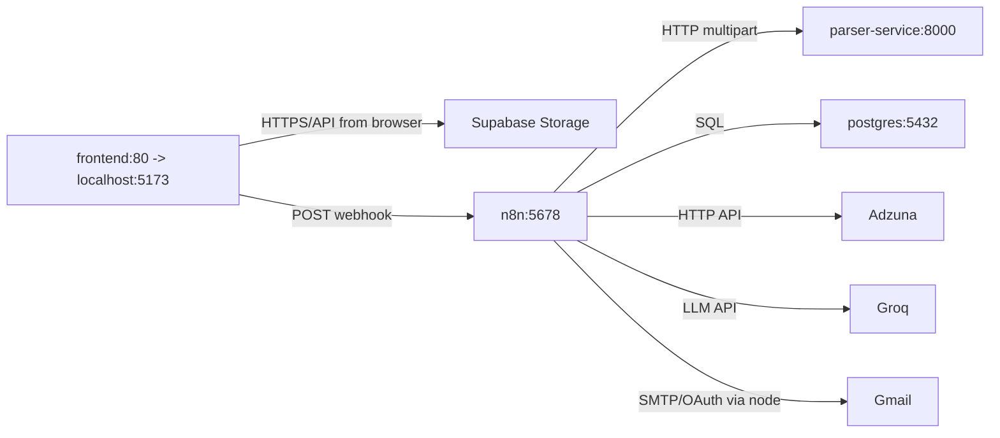

# AI Resume Job Matcher

[](./frontend)
[](./parser-service)
[](./n8n)
[](./db)
[](./docker-compose.yml)

Containerized resume-to-job matching automation that accepts a PDF resume from a React frontend, parses it through FastAPI and Groq-powered n8n workflows, searches Adzuna jobs, stores results in PostgreSQL, reranks matches with AI, and sends a weekly email digest.

> This README is based strictly on the checked-in code and workflow export in this repository.

## Features

- Resume upload from a React form with fields for name, email, preferred roles, city, job type, and a PDF file.
- Supabase Storage upload to a `resumes` bucket with a signed URL generated for downstream processing.
- Webhook-based workflow execution from the frontend to n8n.
- PDF text extraction through a FastAPI service using PyMuPDF.
- Resume parsing with Groq in n8n into structured candidate data:
  - `name`
  - categorized `skills`
  - `projects`
  - `internships`
  - `certifications`
  - `education`
- Adzuna integration against the India jobs endpoint with up to 50 results per search term.
- Search-term fan-out in n8n from a comma-separated preference list, capped to 5 terms.
- PostgreSQL persistence for workflow configuration, ingested jobs, and scoring error records.
- AI compatibility scoring with Groq using a structured JSON schema.
- Matching skills extraction stored in `jobs.matching_skills`.
- Missing skills extraction stored in `jobs.missing_skills`.
- Job reranking based on AI-generated compatibility score and concise reasoning.
- Weekly scheduled execution via an n8n `Schedule Trigger`.
- Weekly HTML email digest generation and delivery through Gmail.
- Failure notification email path through an n8n `Error Trigger`.
- Docker Compose orchestration for the frontend, parser service, PostgreSQL, and n8n.
- Environment-variable driven configuration through root and frontend `.env.example` files.

### Current Repository Notes


## Architecture



## Tech Stack

| Layer | Technology |
| --- | --- |
| Frontend | React 19, Vite, Tailwind CSS 4, React Hook Form, Axios, Supabase JS |
| Backend | FastAPI, Uvicorn, PyMuPDF, Python 3.11 |
| Workflow Automation | n8n, n8n LangChain nodes, Webhook Trigger, Schedule Trigger, Gmail node |
| Database | PostgreSQL 16 |
| AI | Groq chat models via n8n (`llama-3.3-70b-versatile`, `meta-llama/llama-4-scout-17b-16e-instruct`) |
| Storage | Supabase Storage |
| Containerization | Docker, Docker Compose, Nginx |

## Folder Structure

```text
.
|-- .env.example
|-- .gitignore
|-- docker-compose.yml
|-- db
|   `-- init.sql
|-- docs
|-- frontend
|   |-- .dockerignore
|   |-- .env.example
|   |-- .gitignore
|   |-- Dockerfile
|   |-- eslint.config.js
|   |-- index.html
|   |-- nginx.conf
|   |-- package-lock.json
|   |-- package.json
|   |-- vite.config.js
|   |-- public
|   |   |-- favicon.svg
|   |   `-- icons.svg
|   `-- src
|       |-- App.css
|       |-- App.jsx
|       |-- index.css
|       |-- main.jsx
|       |-- components
|       |   `-- ResumeForm.jsx
|       `-- lib
|           `-- supabase.js
|-- n8n
|   `-- workflow.json
|-- parser-service
|   |-- app.py
|   |-- Dockerfile
|   `-- requirements.txt
`-- scripts
```

## Installation

### 1. Clone the repository

```bash
git clone https://github.com/Het-web/AI-Resume-Job-Matcher
cd AI-Resume-Job-Matcher
```

### 2. Prerequisites

- Docker Desktop with Docker Compose support
- A Supabase project with a Storage bucket named `resumes`
- An Adzuna developer account
- A Groq API credential configured inside n8n
- A Gmail OAuth credential configured inside n8n
- An n8n Postgres credential pointing at the `postgres` service

### 3. Configure environment variables

Create the root environment file:

```bash
cp .env.example .env
```

Create the frontend environment file:

```bash
cp frontend/.env.example frontend/.env
```

Fill in:

- PostgreSQL credentials
- n8n encryption key and timezone
- Adzuna API credentials
- Supabase URL and publishable key
- The active n8n webhook URL exposed by your imported workflow

### 4. Start the stack

```bash
docker compose up --build
```

This starts:

- Frontend on `http://localhost:5173`
- Parser service on `http://localhost:8000`
- n8n on `http://localhost:5678`
- PostgreSQL on `localhost:5432`

### 5. Import the workflow into n8n

The repository ships the workflow as [`n8n/workflow.json`](./n8n/workflow.json). After the containers are running:

1. Open `http://localhost:5678`
2. Import `n8n/workflow.json`
3. Reconnect or create the required credentials:
   - `Postgres account`
   - `Groq account`
   - `Gmail account`
4. Copy the active webhook URL from the imported workflow into the frontend env configuration
5. Activate the workflow if you want scheduled execution

<details>
<summary>Why workflow import is required</summary>

The Compose file starts an n8n container, but it does not automatically provision the exported workflow or its credentials. The checked-in `workflow.json` is an export artifact that must be imported into your n8n instance.

</details>

## Environment Variables

### Root `.env`

| Variable | Required | Description |
| --- | --- | --- |
| `POSTGRES_DB` | Yes | PostgreSQL database name used by the `postgres` container and by n8n's Postgres connection settings. |
| `POSTGRES_USER` | Yes | PostgreSQL username. |
| `POSTGRES_PASSWORD` | Yes | PostgreSQL password. |
| `N8N_ENCRYPTION_KEY` | Yes | Encryption key used by n8n to protect stored credentials. |
| `GENERIC_TIMEZONE` | Yes | Timezone used by n8n schedule execution. Default example: `Asia/Kolkata`. |
| `PARSER_SERVICE_URL` | Yes | Internal URL n8n uses to call the FastAPI parser service. Example: `http://parser-service:8000`. |
| `ADZUNA_APP_ID` | Yes | Adzuna application ID used by the job search request. |
| `ADZUNA_APP_KEY` | Yes | Adzuna application key intended for the job search request. |
| `VITE_SUPABASE_URL` | Yes | Supabase project URL for the frontend build. |
| `VITE_SUPABASE_PUBLISHABLE_KEY` | Yes | Supabase publishable key for the frontend build. |
| `VITE_N8N_WEBHOOK_URL` | Yes | Public n8n webhook URL the frontend should call after uploading the resume. |

### `frontend/.env`

| Variable | Required | Description |
| --- | --- | --- |
| `VITE_SUPABASE_URL` | Yes | Supabase project URL consumed by `frontend/src/lib/supabase.js`. |
| `VITE_SUPABASE_PUBLISHABLE_KEY` | Yes | Supabase publishable key consumed by `frontend/src/lib/supabase.js`. |
| `VITE_N8N_WEBHOOK_URL` | Yes | Example webhook variable in the frontend env file. |

## Database

PostgreSQL is initialized automatically by mounting [`db/init.sql`](./db/init.sql) into `/docker-entrypoint-initdb.d/init.sql` inside the `postgres` container.

### Tables

| Table | Status in Repository | Purpose |
| --- | --- | --- |
| `workflow_config` | Created in `db/init.sql` and by the workflow | Stores the latest workflow input state, including digest email, city, job type, search terms, PDF URL, and `max_jobs_to_rerank`. |
| `jobs` | Created in `db/init.sql` and by the workflow | Stores normalized Adzuna job records, AI compatibility score, rerank reasoning, matching skills, missing skills, email flag, and timestamps. |
| `job_score_errors` | Created in `db/init.sql` and by the workflow | Intended to store job scoring failures with raw responses and error messages tied back to `jobs.id`. |

### Table Details

#### `workflow_config`

- Primary key: `id` with a single-row default pattern (`DEFAULT 1`)
- Key fields:
  - `digest_email`
  - `city`
  - `job_type`
  - `search_terms`
  - `pdf_url`
  - `max_jobs_to_rerank`
  - `updated_at`

#### `jobs`

- Primary key: `id` (`uuid`, `gen_random_uuid()`)
- Unique key: `job_id`
- Key metadata:
  - source fields: `job_id`, `source`, `url`
  - job details: `title`, `company`, `location`, `work_type`, `experience_required`, `description`
  - salary fields: `salary_min`, `salary_max`, `salary_raw`, `salary_confidence`
  - AI scoring: `compatibility_score`, `rerank_reasoning`, `matching_skills`, `missing_skills`, `scored_at`
  - delivery state: `emailed`
  - audit timestamp: `created_at`

#### `job_matches`

- Not present in the initialized schema.
- The workflow's email builder assumes it exists and includes at least:
  - `resume_hash`
  - `job_id`
  - `emailed`

#### `job_score_errors`

- Primary key: `id` (`uuid`, `gen_random_uuid()`)
- Foreign key: `job_id` references `jobs(id)` with `ON DELETE CASCADE`
- Fields:
  - `source`
  - `raw_response`
  - `error_message`
  - `created_at`

## Workflow

The n8n workflow file is [`n8n/workflow.json`](./n8n/workflow.json). Its exported name is:

`Weekly Adzuna India Jobs Digest - Resume PDF Rerank`

### Pipeline

1. A user submits the frontend form.
2. The frontend uploads the resume PDF to Supabase Storage bucket `resumes`.
3. The frontend creates a signed URL for the uploaded file.
4. The frontend posts candidate preferences and the signed PDF URL to the n8n webhook.
5. The workflow normalizes input into a `Workflow Config` payload.
6. If the webhook carried a `pdfUrl`, the workflow upserts row `id = 1` in `workflow_config`.
7. The workflow downloads the resume PDF from the signed URL.
8. The downloaded file is posted as multipart form data to `PARSER_SERVICE_URL/extract`.
9. The FastAPI parser extracts raw text from the PDF.
10. Groq parses the raw resume text into structured JSON fields.
11. n8n normalizes that JSON into consistent arrays and metadata.
12. Search terms are split from `search_terms`, trimmed, deduplicated only implicitly by user input, and capped to 5 terms.
13. For each term, n8n calls the Adzuna India search endpoint.
14. Adzuna results are split into individual job records.
15. Each job is normalized into a PostgreSQL-ready object.
16. Each normalized job is upserted into the `jobs` table.
17. Candidate jobs are selected from PostgreSQL using:
    - source `adzuna`
    - `emailed = false`
    - posted within the last 7 days
    - title keyword filters such as `engineer`, `developer`, `ai`, `python`, `backend`, `frontend`, `devops`, and related terms
18. Candidate jobs are processed in batches of 10.
19. For each job, n8n builds a Groq prompt comparing resume skills against the job description.
20. Groq returns structured output containing:
    - `compatibility_score`
    - `reasoning`
    - `matching_skills`
    - `missing_skills`
21. n8n validates and normalizes the model output.
22. PostgreSQL is updated with score, reasoning, matching skills, missing skills, and `scored_at`.
23. The workflow waits 60 seconds between rerank batches.
24. After scoring, the workflow selects the top 5 reranked jobs from the last 7 days.
25. n8n builds an HTML weekly digest email.
26. Gmail sends the digest to `workflow_config.digest_email`.
27. If the workflow throws an error, the `Error Trigger` path builds and sends a failure email.

### Webhook Execution

- Trigger node: `Webhook`
- HTTP method: `POST`
- Exported path in the workflow file: `/webhook/bbe0882c-122b-450c-8e12-c4d03ae90430`
- Incoming payload fields used by the workflow:
  - `email`
  - `city`
  - `search_terms`
  - `job_type`
  - `pdfUrl`
  - optional `max_jobs_to_rerank`

### Schedule Execution

- Trigger node: `Schedule Trigger`
- Frequency in the export: weekly
- Day: Monday (`triggerAtDay: 1`)
- Hour: `08:00`
- Timezone source: `GENERIC_TIMEZONE`

On scheduled runs, the workflow reloads the last saved row from `workflow_config` and reuses the stored resume PDF URL and search preferences.

### Batch Processing

- Adzuna requests are batched one search term at a time.
- Reranking uses `Split In Batches` with `batchSize: 10`.
- The workflow pauses for 60 seconds after each rerank batch.
- Candidate selection is capped to 50 jobs before reranking.
- Final digest selection is capped to 5 jobs.

### Email Generation

- Email provider: Gmail node
- Digest output:
  - job title
  - company
  - location
  - compatibility score
  - salary summary
  - rerank reasoning
  - matching skills
  - missing skills
  - apply link
- Empty-result behavior:
  - sends a "No New Matches" email if no jobs remain after selection
- Failure behavior:
  - sends a separate failure email with workflow and error details

## Docker

The stack is orchestrated by [`docker-compose.yml`](./docker-compose.yml).

### Services

| Service | Image / Build | Purpose |
| --- | --- | --- |
| `frontend` | Built from `./frontend` | Builds the React app with Vite and serves the static output through Nginx on port `5173`. |
| `parser-service` | Built from `./parser-service` | Runs the FastAPI PDF extraction service on port `8000`. |
| `postgres` | `postgres:16-alpine` | Stores workflow configuration and job data, and auto-runs `db/init.sql` at initialization time. |
| `n8n` | `n8nio/n8n:latest` | Hosts the automation workflow, webhook endpoint, scheduled trigger, AI steps, and Gmail delivery on port `5678`. |

### Service Communication

- `frontend` communicates with:
  - Supabase Storage directly from the browser
  - n8n through a configured webhook URL
- `n8n` communicates with:
  - `parser-service` through `PARSER_SERVICE_URL`
  - `postgres` through the internal Docker network
  - Groq through configured n8n credentials
  - Adzuna through outbound HTTP
  - Gmail through configured n8n credentials
- `postgres` communicates with:
  - n8n for schema creation, workflow config persistence, job upserts, scoring updates, and digest queries



## Future Improvements

- Add authentication and per-user workflow configuration instead of a single shared `workflow_config` row.
- Support multiple resumes and historical candidate profiles.
- Add more job boards alongside Adzuna.
- Persist resume-to-job match records explicitly with a real `job_matches` schema.
- Add resume improvement suggestions generated from missing skills and low-score jobs.
- Add frontend pages for reviewing matched jobs and email history.
- Track score trends over time for the same resume.
- Add semantic search and embeddings-based retrieval for better job selection.
- Add application tracking and status management.
- Add schema migrations and automated workflow provisioning.

## License

This project is licensed under the MIT License. See the [LICENSE](LICENSE) file for details.

